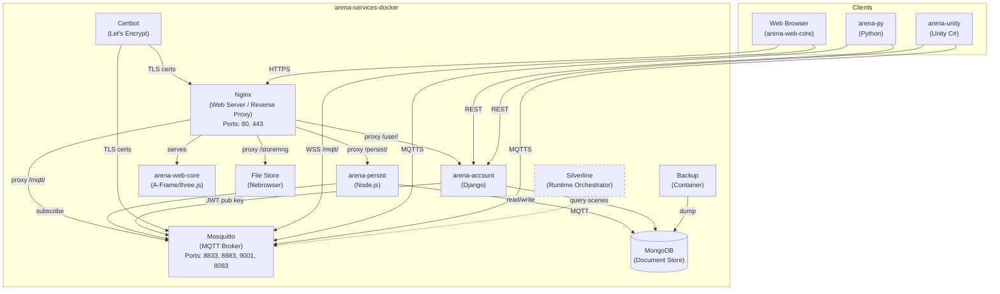
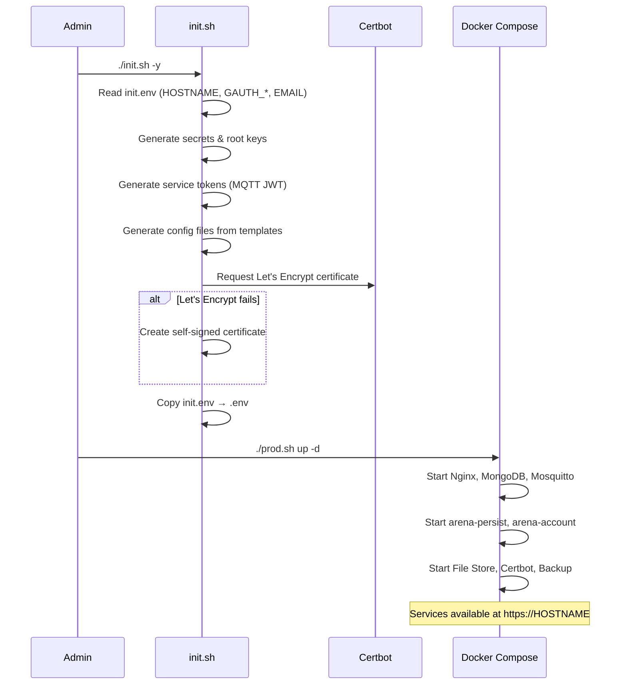

# ARENA Services Docker — Requirements & Architecture

> **Purpose**: Machine- and human-readable reference for the ARENA Docker orchestration stack's features, architecture, and source layout.

## System Context

## Source File Index

| File | Role | Key Symbols |
|------|------|-------------|
| [docker-compose.yaml](docker-compose.yaml) | Base compose config (shared services) | `arena-web`, `mongodb`, `mosquitto`, `persist`, `arena-account`, `store` |
| [docker-compose.prod.yaml](docker-compose.prod.yaml) | Production config (versioned images, monitoring, backup) | `backup`, `watchtower` |
| [docker-compose.staging.yaml](docker-compose.staging.yaml) | Staging config (dev folder on webserver) | staging overrides |
| [docker-compose.localdev.yaml](docker-compose.localdev.yaml) | Local dev config (builds from submodules) | local volume mounts |
| [docker-compose.demo.yaml](docker-compose.demo.yaml) | Demo config (pre-built images, minimal setup) | demo overrides |
| [init.sh](init.sh) | Master init script | secrets, root keys, tokens, config files, certificates |
| [init-config.sh](init-config.sh) | Config file generator | generates `conf/` from `conf-templates/` |
| [init.env](init.env) | Initial environment config | `HOSTNAME`, `JITSI_HOSTNAME`, `EMAIL`, `GAUTH_*` |
| [prod.sh](prod.sh) | Production launcher | `docker-compose` with prod YAML |
| [staging.sh](staging.sh) | Staging launcher | `docker-compose` with staging YAML |
| [localdev.sh](localdev.sh) | Dev launcher | `docker-compose` with localdev YAML |
| [demo.sh](demo.sh) | Demo launcher | `docker-compose` with demo YAML |
| [update-submodules.sh](update-submodules.sh) | Submodule updater | pulls latest `arena-web-core`, `arena-persist`, `arena-account` |
| [update-versions.sh](update-versions.sh) | Version tracker | updates `VERSION` from submodule tags |
| [VERSION](VERSION) | Release versions | service image versions for production |
| [arena-web-core/](arena-web-core/) | Submodule: browser client | A-Frame/three.js 3D client |
| [arena-persist/](arena-persist/) | Submodule: persistence service | Node.js MQTT→MongoDB |
| [arena-account/](arena-account/) | Submodule: auth service | Django OAuth + JWT ACL |

## Feature Requirements

### Container Orchestration

| ID | Requirement | Source |
|----|-------------|--------|
| REQ-SD-001 | Nginx reverse proxy serves web client, proxies to persist/account/MQTT/store | [docker-compose.yaml](docker-compose.yaml) |
| REQ-SD-002 | MongoDB document store for scene persistence and user data | [docker-compose.yaml](docker-compose.yaml) |
| REQ-SD-003 | Mosquitto MQTT broker with JWT auth plugin (ports 8833/8883/9001/8083) | [docker-compose.yaml](docker-compose.yaml) |
| REQ-SD-004 | arena-persist container subscribes to MQTT and writes to MongoDB | [docker-compose.yaml](docker-compose.yaml) |
| REQ-SD-005 | arena-account container handles OAuth and JWT issuance | [docker-compose.yaml](docker-compose.yaml) |
| REQ-SD-006 | File Store container ([filebrowser](https://github.com/filebrowser/filebrowser)) for user asset storage | [docker-compose.yaml](docker-compose.yaml) |
| REQ-SD-007 | Certbot container for Let's Encrypt certificate management | [docker-compose.yaml](docker-compose.yaml) |
| REQ-SD-008 | Backup container for MongoDB dumps | [docker-compose.prod.yaml](docker-compose.prod.yaml) |
| REQ-SD-009 | [Silverline](https://github.com/arenaxr/silverline-services-docker) runtime orchestrator integration (replaces legacy ARTS) | External |

### TLS/SSL

| ID | Requirement | Source |
|----|-------------|--------|
| REQ-SD-010 | Let's Encrypt certificate auto-provisioning and renewal | [init.sh](init.sh) |
| REQ-SD-011 | Self-signed certificate fallback for localhost/local domains | [init.sh](init.sh) |
| REQ-SD-012 | TLS on Nginx (443), Mosquitto (8883, 8083) | [conf-templates/](conf-templates/) |

### Authentication Configuration

| ID | Requirement | Source |
|----|-------------|--------|
| REQ-SD-020 | Google OAuth Web application credentials | [init.env](init.env) |
| REQ-SD-021 | Google OAuth Desktop (installed) credentials | [init.env](init.env) |
| REQ-SD-022 | Google OAuth TV/Limited-Input device credentials | [init.env](init.env) |

### Multi-Environment Support

| ID | Requirement | Source |
|----|-------------|--------|
| REQ-SD-030 | Production deployment with versioned images and monitoring | [prod.sh](prod.sh), [docker-compose.prod.yaml](docker-compose.prod.yaml) |
| REQ-SD-031 | Staging deployment with dev folder on web server | [staging.sh](staging.sh), [docker-compose.staging.yaml](docker-compose.staging.yaml) |
| REQ-SD-032 | Local development with source-built containers | [localdev.sh](localdev.sh), [docker-compose.localdev.yaml](docker-compose.localdev.yaml) |
| REQ-SD-033 | Demo deployment with minimal pre-built config | [demo.sh](demo.sh), [docker-compose.demo.yaml](docker-compose.demo.yaml) |

### Deployment & Versioning

| ID | Requirement | Source |
|----|-------------|--------|
| REQ-SD-040 | Submodule management (arena-web-core, arena-persist, arena-account) | [update-submodules.sh](update-submodules.sh), [.gitmodules](.gitmodules) |
| REQ-SD-041 | Version tracking from submodule tags | [update-versions.sh](update-versions.sh), [VERSION](VERSION) |
| REQ-SD-042 | Config generation from templates using hostname/certs | [init-config.sh](init-config.sh), [conf-templates/](conf-templates/) |

## Init & Deploy Sequence

## Planned / Future

- Jitsi co-located deployment (`jitsi-add.sh` for same-machine setup)
- Silverline runtime containers fully integrated into compose stack
- Automated health monitoring and alerting
